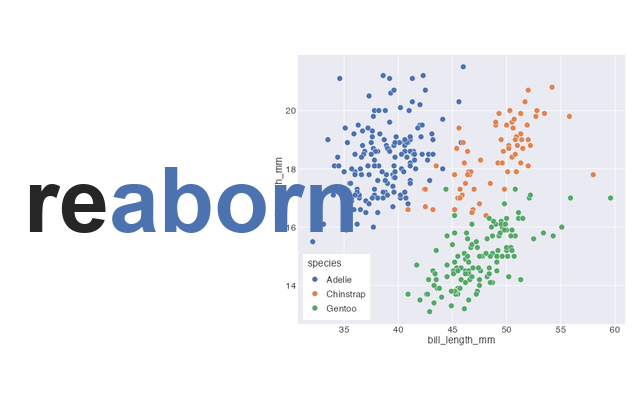

# reaborn 

<!-- badges: start -->

[](https://github.com/shawntz/reaborn/tree/main)
[](https://CRAN.R-project.org/package=reaborn)
[](https://cran.r-project.org/package=badger)
[](https://lifecycle.r-lib.org/articles/stages.html#experimental)
[](https://github.com/shawntz/reaborn/actions/workflows/build.yml)
[](https://github.com/shawntz/reaborn/actions/workflows/air-format-check.yml)
[](https://github.com/shawntz/reaborn/actions/workflows/air-format-suggest.yaml)
[](https://github.com/shawntz/reaborn/actions/workflows/spellcheck.yml)
[](https://github.com/shawntz/reaborn/actions/workflows/pkgdown.yaml)

<!-- badges: end -->

**reaborn** is an R port of Python's [seaborn](https://seaborn.pydata.org/). It
mirrors seaborn's public function API — identical function names, argument names,
and defaults — and renders **visually indistinguishable** plots using
[ggplot2](https://ggplot2.tidyverse.org/). You can paste seaborn Python into R
and get the same plot.

Because every reaborn plot **is** a ggplot, you can extend it with the entire
ggplot2 grammar of graphics — something seaborn can't do.

```r
install.packages("reaborn")
library(reaborn)
```

Or install the development version from GitHub:

```r
# install.packages("remotes")
remotes::install_github("shawntz/reaborn")
```

## Paste seaborn Python into R

`library(reaborn)` installs the seaborn default theme and palette globally (like
`sns.set_theme()`), exposes `sns.`-prefixed aliases for every function, and binds
the Python literals `True`/`False`/`None`. So this seaborn snippet runs verbatim:

```r
penguins <- load_dataset("penguins")

sns.scatterplot(data = penguins, x = "bill_length_mm", y = "bill_depth_mm",
                hue = "species")

sns.histplot(data = penguins, x = "flipper_length_mm", hue = "species",
             multiple = "stack", kde = True)
```

Or write it idiomatically (the `sns.` prefix is optional):

```r
scatterplot(data = penguins, x = "bill_length_mm", y = "bill_depth_mm", hue = "species")
```

## reaborn plots are ggplots

Every function returns a `ggplot`, so compose freely:

```r
scatterplot(data = penguins, x = "bill_length_mm", y = "bill_depth_mm", hue = "species") +
  ggplot2::facet_wrap(~island) +
  ggplot2::scale_x_log10() +
  ggplot2::labs(title = "Penguin bills")
```

## What's implemented

The full classic seaborn function API:

| Module | Functions |
|---|---|
| Relational | `scatterplot` `lineplot` `relplot` |
| Distributions | `histplot` `kdeplot` `ecdfplot` `rugplot` `displot` |
| Categorical | `boxplot` `violinplot` `boxenplot` `stripplot` `swarmplot` `barplot` `pointplot` `countplot` `catplot` |
| Regression | `regplot` `residplot` `lmplot` |
| Matrix | `heatmap` `clustermap` |
| Grids | `pairplot` `jointplot` `FacetGrid` |
| Misc | `palplot` `dogplot` |
| Palettes | `color_palette` `hls_palette` `husl_palette` `cubehelix_palette` `light_palette` `dark_palette` `diverging_palette` `blend_palette` `mpl_palette` `set_color_codes` … |
| Theming | `set_theme` `set_style` `set_context` `axes_style` `plotting_context` `despine` `move_legend` … |

## Fidelity

reaborn matches seaborn by extracting ground-truth constants from a real seaborn
install rather than approximating:

- **Palettes** match seaborn's hex codes exactly.
- **Themes** reproduce the five seaborn styles × four contexts.

## Python → R conversion notes

Most seaborn calls paste over directly. The remaining edits are language-level:

| Python | R |
|---|---|
| `sns.scatterplot(...)` | works as-is (`sns.scatterplot`) |
| `data=df, x="col", hue="g"` | works as-is (named args, string columns) |
| `True` / `False` / `None` | bound for you, or write `TRUE` / `FALSE` / `NULL` |
| `[1, 2, 3]` (list) | `c(1, 2, 3)` |
| `{"a": 1}` (dict) | `list(a = 1)` |
| `(1, 2)` (tuple) | `c(1, 2)` |
| `df.col` | `df$col` |

## License

BSD 3-Clause (matching seaborn). seaborn is © Michael Waskom.
