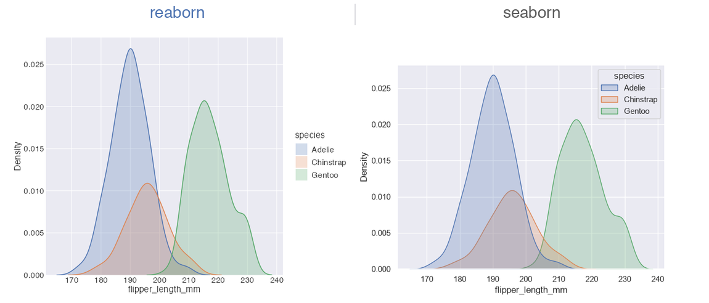

# reaborn vs. seaborn vs. ggplot2

## Where reaborn fits

reaborn is a faithful R port of Python’s **seaborn**, built on
**ggplot2**. It mirrors seaborn’s public API exactly — same function
names, same argument names, same defaults — so the plotting code you
already know runs in R with little to no translation. The defaults that
make seaborn plots look good out of the box (the styles, the palettes,
the spacing) come along for the ride, because reaborn reproduces them
rather than approximating them.



The part seaborn can’t match: **every reaborn plot *is* a ggplot
object.** A call like `scatterplot(...)` returns a `ggplot`, so you can
keep building with the full grammar of graphics — add `facet_wrap()`,
swap in `scale_x_log10()`, layer extra geoms, override the theme. You
get seaborn’s defaults as a starting point and ggplot2’s composability
as the ceiling.

## Feature comparison

| Capability | reaborn | seaborn | ggplot2 |
|----|----|----|----|
| **Identical seaborn API** (names, args, defaults) | ✅ Full — ~40 functions ported 1:1 | ✅ It *is* the API | ❌ Different grammar entirely |
| **Copy-paste Python code runs verbatim** | ✅ `sns.` aliases + `True`/`False`/`None` bound | ✅ Native Python | ❌ |
| **Statistical fidelity** (KDE, bins, bootstrap CIs) | ✅ Matches seaborn/scipy/numpy to machine precision | ✅ Reference implementation | ⚠️ Different methods |
| **Theming & palettes match seaborn exactly** | ✅ Hex-exact; global like [`sns.set_theme()`](https://reaborn.org/reference/sns-aliases.md) | ✅ Reference | ⚠️ Its own (good) defaults |
| **Grammar-of-graphics extensibility** | ✅ Returns a real `ggplot` | ❌ Returns matplotlib `Axes` | ✅ Native, most complete |
| **Breadth of arbitrary custom geoms/stats** | ⚠️ Inherits ggplot2’s | ⚠️ Fixed function set | ✅ The widest |
| **Language / ecosystem** | R (tidyverse-adjacent) | Python (pandas/matplotlib) | R (tidyverse) |
| **Dependency weight** | 🟢 Light: ggplot2 stack; heavy bits are `Suggests` | 🟡 matplotlib + numpy + scipy + pandas | 🟢 Light |
| **License** | BSD-3 (same as seaborn) | BSD-3 | MIT |

✅ first-class · ⚠️ partial/with caveats · ❌ not a goal · 🟢/🟡
lighter/heavier.

## Coming from seaborn?

In most cases you change **nothing but the language host**. After
[`library(reaborn)`](https://reaborn.org), the `sns.` aliases, the
global theme, and the `True`/`False`/`None` literals are all in scope,
so a seaborn snippet pasted into R runs as-is.

``` r

library(reaborn)   # sets seaborn theme + palette globally, like sns.set_theme()

# This is literally seaborn code — it runs verbatim in R:
sns.scatterplot(data = penguins, x = "bill_length_mm", y = "bill_depth_mm",
                hue = "species")
```

| Python (seaborn) | R (reaborn) | Note |
|----|----|----|
| `import seaborn as sns` | [`library(reaborn)`](https://reaborn.org) | Sets theme/palette globally, exposes `sns.` aliases |
| [`sns.set_theme()`](https://reaborn.org/reference/sns-aliases.md) | *automatic on load* |  |
| `sns.scatterplot(data=df, x="a", y="b", hue="g")` | same line, verbatim | `sns.` alias + `=` kwargs both work |
| `True` / `False` / `None` | `True` / `False` / `None` | Bound to `TRUE` / `FALSE` / `NULL` |
| string columns: `x="col"` | `x = "col"` | seaborn’s string-column API is preserved |
| `ax.set(...)` (matplotlib) | `+ ggplot2::labs(...)`, `+ theme(...)` | You now get the *ggplot* grammar |

## Coming from ggplot2?

You already love the grammar of graphics. reaborn doesn’t ask you to
give it up — it hands you **seaborn’s defaults and statistics as a
starting layer, returned as an ordinary `ggplot`** that you keep
building.

- **Skip the boilerplate.** `histplot(data, x="x", hue="g")` gets you
  seaborn’s binning, palette, and theme in one call — then
  `+ facet_wrap(~year) + scale_x_log10()` is yours.
- **It composes, it doesn’t replace.** Everything is a real `ggplot`, so
  `patchwork`, custom scales, extra geoms, and your theme tweaks all
  keep working.
