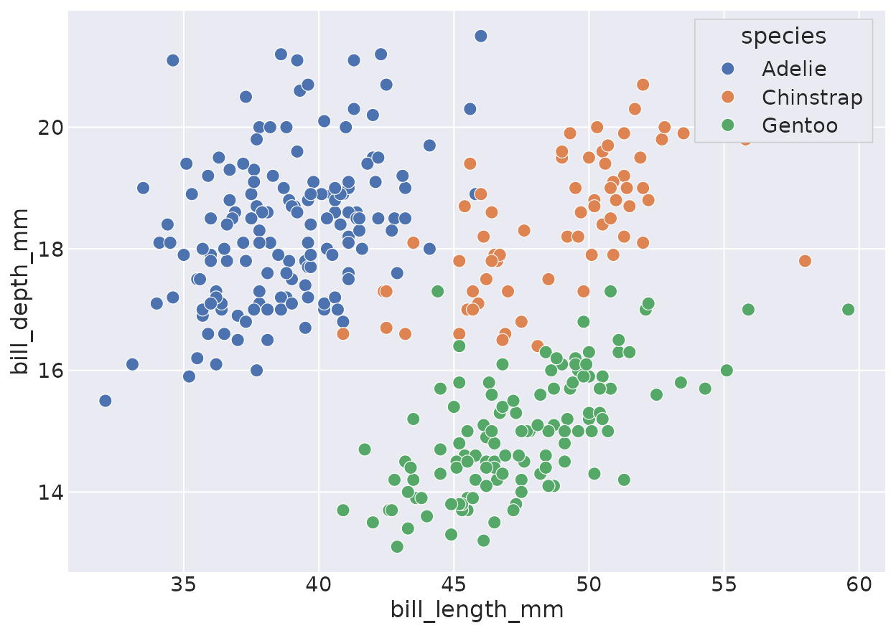
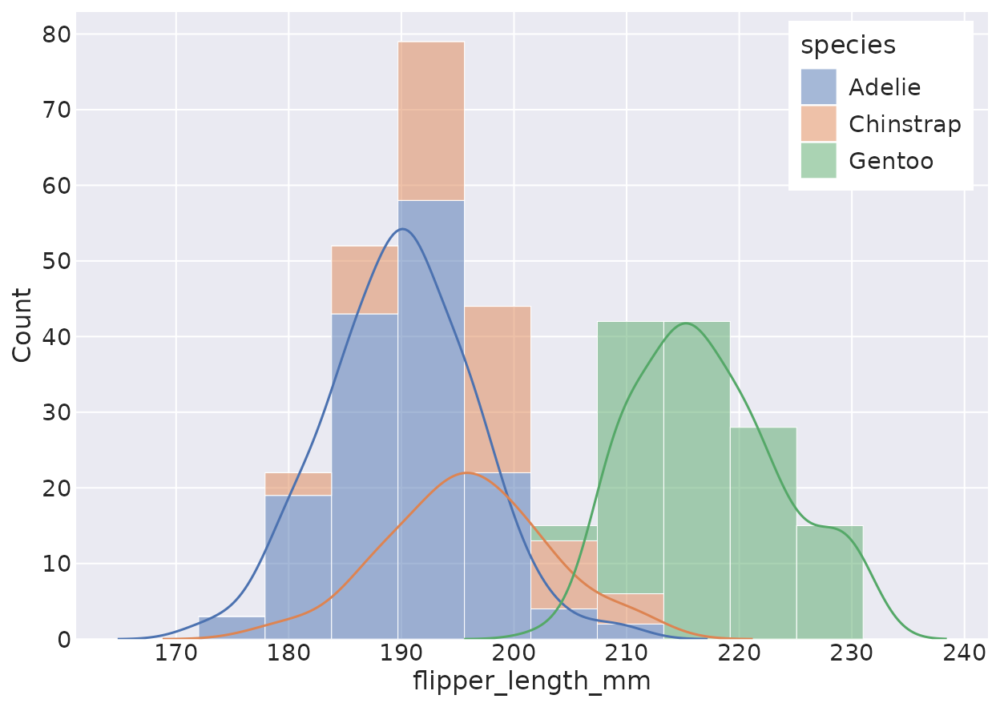
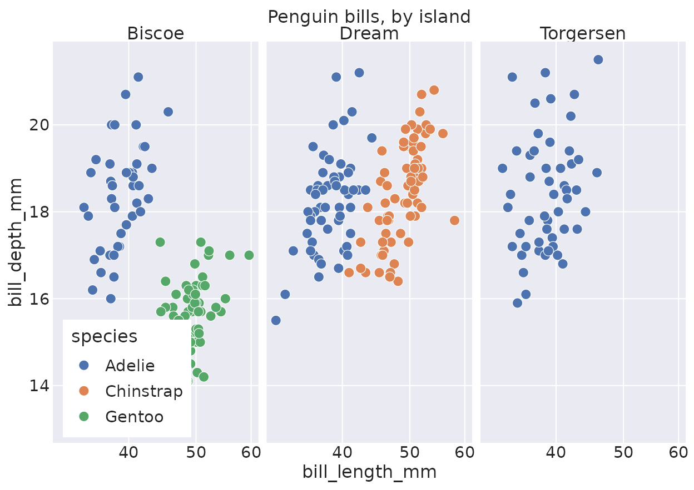

# Get started with reaborn

**reaborn** is an R port of Python’s
[seaborn](https://seaborn.pydata.org), built on
[ggplot2](https://ggplot2.tidyverse.org). It mirrors seaborn’s function
API exactly and renders visually indistinguishable plots — and because
every result is a real `ggplot`, you can keep extending it with the
grammar of graphics.

## Install

``` r

install.packages("reaborn")
```

Or install the development version from GitHub:

``` r

# install.packages("remotes")
remotes::install_github("shawntz/reaborn")
```

## One import sets the scene

Attaching reaborn does three things, mirroring `import seaborn as sns`
followed by
[`sns.set_theme()`](https://reaborn.org/reference/sns-aliases.md):

``` r

library(reaborn)
```

1.  It **sets the seaborn theme and palette globally**, so every plot
    inherits the familiar seaborn look.
2.  It exposes **`sns.`-prefixed aliases** for every function, so pasted
    Python runs verbatim.
3.  It binds the Python literals **`True`**, **`False`**, and **`None`**
    to R’s `TRUE`, `FALSE`, and `NULL`.

## Your first plot

Load one of seaborn’s example datasets and make a plot. This is
literally seaborn syntax — string column names, named arguments, the
`sns.` prefix:

``` r

penguins <- load_dataset("penguins")

sns.scatterplot(data = penguins, x = "bill_length_mm", y = "bill_depth_mm",
                hue = "species")
```



Prefer idiomatic R? Drop the `sns.` prefix — the bare names work too:

``` r

histplot(data = penguins, x = "flipper_length_mm", hue = "species",
         multiple = "stack", kde = TRUE)
```



## Every plot is a ggplot

This is reaborn’s superpower over seaborn. A plotting call returns a
`ggplot` object, so you can layer on facets, scales, themes, and extra
geoms:

``` r

scatterplot(data = penguins, x = "bill_length_mm", y = "bill_depth_mm", hue = "species") +
  ggplot2::facet_wrap(~island) +
  ggplot2::scale_x_log10() +
  ggplot2::labs(title = "Penguin bills, by island")
```



## The function families

reaborn implements all ~40 seaborn functions. A few entry points:

| Goal | Function(s) |
|----|----|
| Relationships between numeric variables | [`scatterplot()`](https://reaborn.org/reference/scatterplot.md), [`lineplot()`](https://reaborn.org/reference/lineplot.md), [`relplot()`](https://reaborn.org/reference/relplot.md) |
| Distributions | [`histplot()`](https://reaborn.org/reference/histplot.md), [`kdeplot()`](https://reaborn.org/reference/kdeplot.md), [`ecdfplot()`](https://reaborn.org/reference/ecdfplot.md), [`displot()`](https://reaborn.org/reference/displot.md) |
| Categorical comparisons | [`boxplot()`](https://reaborn.org/reference/boxplot.md), [`violinplot()`](https://reaborn.org/reference/violinplot.md), [`barplot()`](https://reaborn.org/reference/barplot.md), [`stripplot()`](https://reaborn.org/reference/stripplot.md), [`catplot()`](https://reaborn.org/reference/catplot.md) |
| Model fits | [`regplot()`](https://reaborn.org/reference/regplot.md), [`lmplot()`](https://reaborn.org/reference/lmplot.md) |
| Matrices | [`heatmap()`](https://reaborn.org/reference/heatmap.md), [`clustermap()`](https://reaborn.org/reference/clustermap.md) |
| Multi-plot grids | [`pairplot()`](https://reaborn.org/reference/pairplot.md), [`jointplot()`](https://reaborn.org/reference/jointplot.md) |

See the [Gallery](https://reaborn.org/articles/gallery.md) for live
examples of each, and the [function
reference](https://reaborn.org/reference/) for full argument lists.

## Coming from seaborn?

In most cases you change **nothing but the language host**. After
[`library(reaborn)`](https://reaborn.org), the `sns.` aliases, the
global theme, and the `True`/`False`/`None` literals are all in scope.

| Python (seaborn) | R (reaborn) |
|----|----|
| `import seaborn as sns` | [`library(reaborn)`](https://reaborn.org) |
| [`sns.set_theme()`](https://reaborn.org/reference/sns-aliases.md) | *automatic on load* |
| `sns.scatterplot(data=df, x="a", y="b", hue="g")` | same line, verbatim |
| `True` / `False` / `None` | `True` / `False` / `None` (bound to `TRUE`/`FALSE`/`NULL`) |
| `[1, 2, 3]` · `{"a": 1}` · `(1, 2)` | `c(1, 2, 3)` · `list(a = 1)` · `c(1, 2)` |

The one thing that’s truly different — and better — is what you do
*after* the call: instead of mutating a matplotlib `Axes`, you add
ggplot2 layers with `+`.
