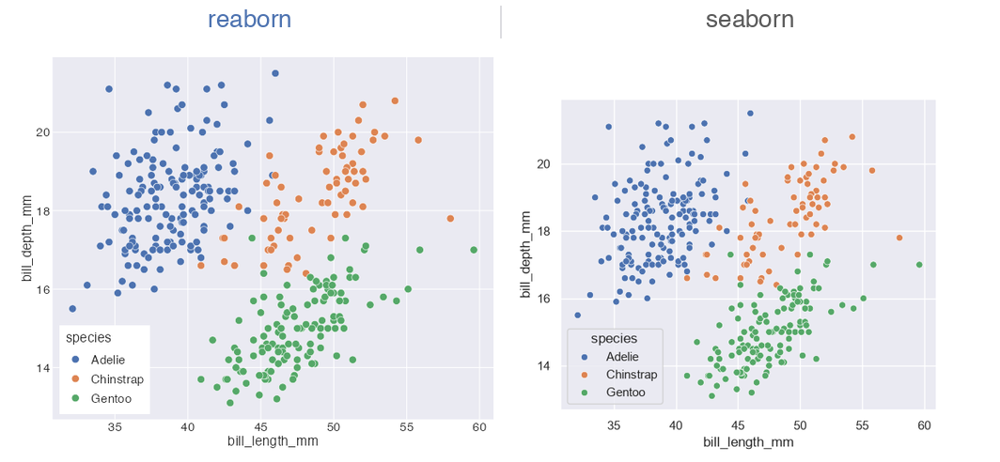
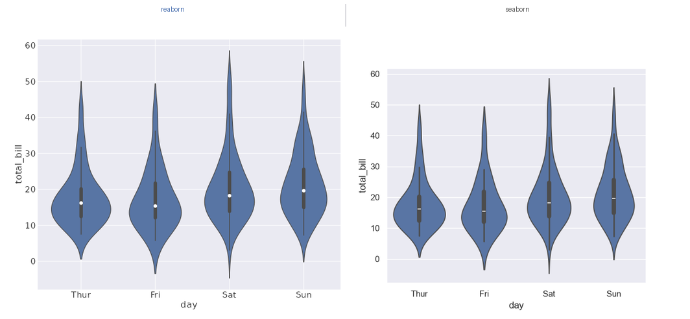
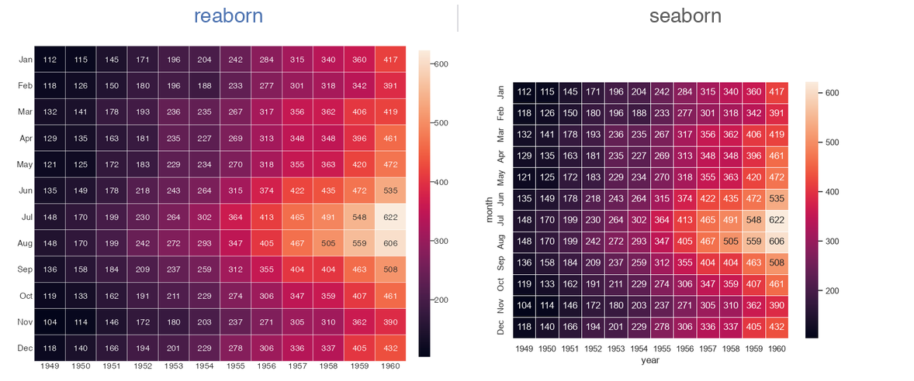
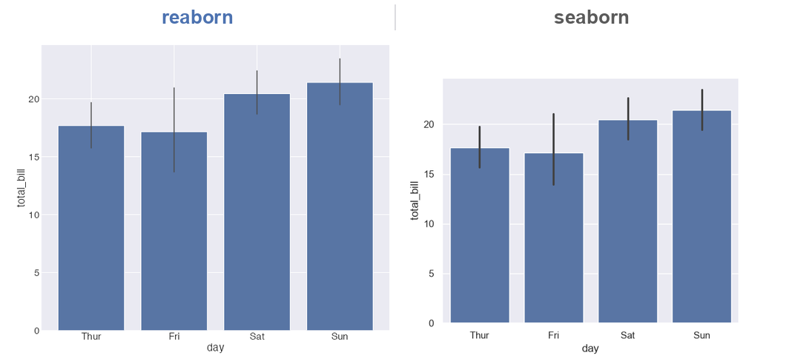

<!-- badges: start -->

[](https://github.com/shawntz/reaborn/tree/main)
[](https://lifecycle.r-lib.org/articles/stages.html#experimental)
[](https://github.com/shawntz/reaborn/actions/workflows/build.yml)
[](https://github.com/shawntz/reaborn/actions/workflows/air-format-check.yml)
[](https://github.com/shawntz/reaborn/actions/workflows/air-format-suggest.yaml)
[](https://github.com/shawntz/reaborn/actions/workflows/spellcheck.yml)
[](https://github.com/shawntz/reaborn/actions/workflows/pkgdown.yaml)

<!-- badges: end -->

<div class="rb-hero">

# seaborn for R, built on ggplot2

<p class="rb-lead">Write the exact seaborn call you already know — same function names, arguments, and defaults — and get a plot that's <strong>visually indistinguishable</strong> from Python. Every result is a real <code>ggplot</code>, so you can keep extending it with the full grammar of graphics.</p>

<p class="rb-cta">
<a href="articles/reaborn.html" class="btn btn-primary btn-lg">Get started</a>
<a href="articles/gallery.html" class="btn btn-outline-primary btn-lg">See the gallery</a>
</p>

</div>

```r
library(reaborn)
penguins <- load_dataset("penguins")

# This is literally seaborn code — it runs verbatim in R:
sns.scatterplot(data = penguins, x = "bill_length_mm", y = "bill_depth_mm", hue = "species")
```

## Same code. Same plot.

<figure class="rb-compare">

<figcaption>The <strong>same</strong> call, rendered by reaborn (left) and Python seaborn (right).</figcaption>
</figure>

## Why reaborn

<div class="rb-features">

<div class="rb-card">
<h3>Your seaborn code, verbatim</h3>
<p>Every function name, argument, and default mirrors seaborn exactly. <code>library(reaborn)</code> sets the seaborn theme and palette globally, exposes <code>sns.</code>-prefixed aliases, and binds <code>True</code>/<code>False</code>/<code>None</code> — so seaborn examples run in R with zero edits.</p>
</div>

<div class="rb-card">
<h3>Exact numbers, indistinguishable plots</h3>
<p>The constants are tested against the real thing: palettes match seaborn's hex codes to the digit, KDEs reproduce <code>scipy.stats.gaussian_kde</code> to machine precision, and histogram bins match <code>numpy.histogram_bin_edges</code>. The rendered output is visually indistinguishable from seaborn, not byte-identical.</p>
</div>

<div class="rb-card">
<h3>Every plot is a ggplot</h3>
<p>reaborn doesn't just look like ggplot — each plot <em>is</em> a ggplot object. Extend any chart with the full grammar of graphics, something seaborn fundamentally can't do.</p>
</div>

<div class="rb-card">
<h3>seaborn defaults, on import</h3>
<p>The five seaborn styles across four contexts (<code>paper</code>/<code>notebook</code>/<code>talk</code>/<code>poster</code>) and every palette ships built in and applies globally — just like <code>sns.set_theme()</code>.</p>
</div>

<div class="rb-card">
<h3>Bootstrap CIs, done right</h3>
<p>Confidence intervals use seaborn's bootstrap resampling, not ggplot's analytic standard error. Your <code>barplot</code>, <code>pointplot</code>, <code>lineplot</code>, and <code>regplot</code> error bars match seaborn's.</p>
</div>

<div class="rb-card">
<h3>Pure R, zero Python</h3>
<p>No reticulate, no Python install, no environment to manage. Just R, ggplot2, and a light dependency footprint — backed by 277 passing tests.</p>
</div>

</div>

## It's a ggplot — so keep building

A seaborn call gets you the look and the statistics in one line. Because the result is an ordinary `ggplot`, the grammar of graphics is yours from there:

```r
scatterplot(data = penguins, x = "bill_length_mm", y = "bill_depth_mm", hue = "species") +
  ggplot2::facet_wrap(~island) +
  ggplot2::scale_x_log10() +
  ggplot2::labs(title = "Penguin bills")
```

## A faithful gallery

<div class="rb-gallery-grid">
<a href="articles/gallery.html"></a>
<a href="articles/gallery.html"></a>
<a href="articles/gallery.html"></a>
<a href="articles/gallery.html"></a>
</div>

<p class="rb-center"><a href="articles/gallery.html" class="btn btn-outline-primary">See the full gallery →</a></p>

## Frequently asked

**Is there a seaborn for R?** Yes — reaborn. It implements all ~40 seaborn functions with identical names, arguments, and defaults.

**How do I use seaborn in R?** Install reaborn, call `library(reaborn)`, and write seaborn code. `sns.scatterplot(data=penguins, x="bill_length_mm", y="bill_depth_mm", hue="species")` runs verbatim.

**Can I use seaborn plots with ggplot2?** Yes, and it's reaborn's edge over seaborn — every plot is a real ggplot you can extend with `+ facet_wrap()`, `+ scale_*()`, `+ theme()`, and more.

**Do reaborn plots look exactly like seaborn?** They're designed to be visually indistinguishable: hex-exact palettes, scipy-precise KDEs, numpy-exact bins, and seaborn's bootstrap CIs.

## Install

```r
# install.packages("remotes")
remotes::install_github("shawntz/reaborn")
```
